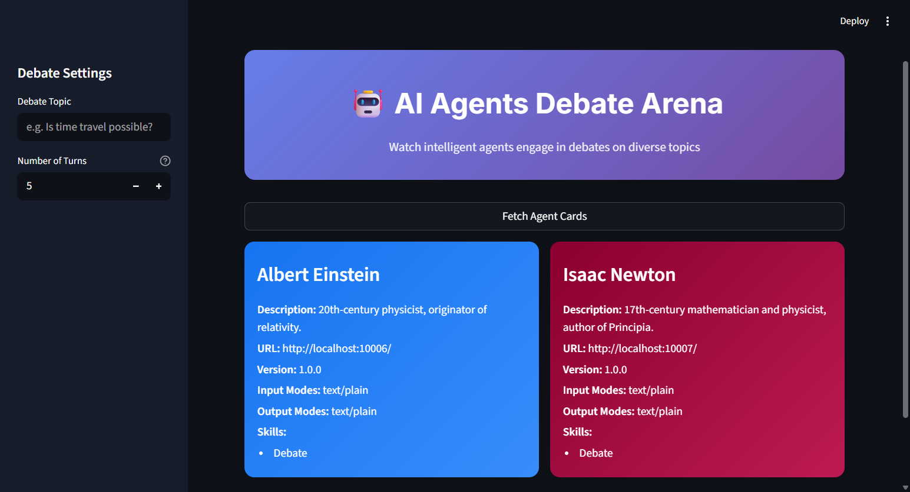
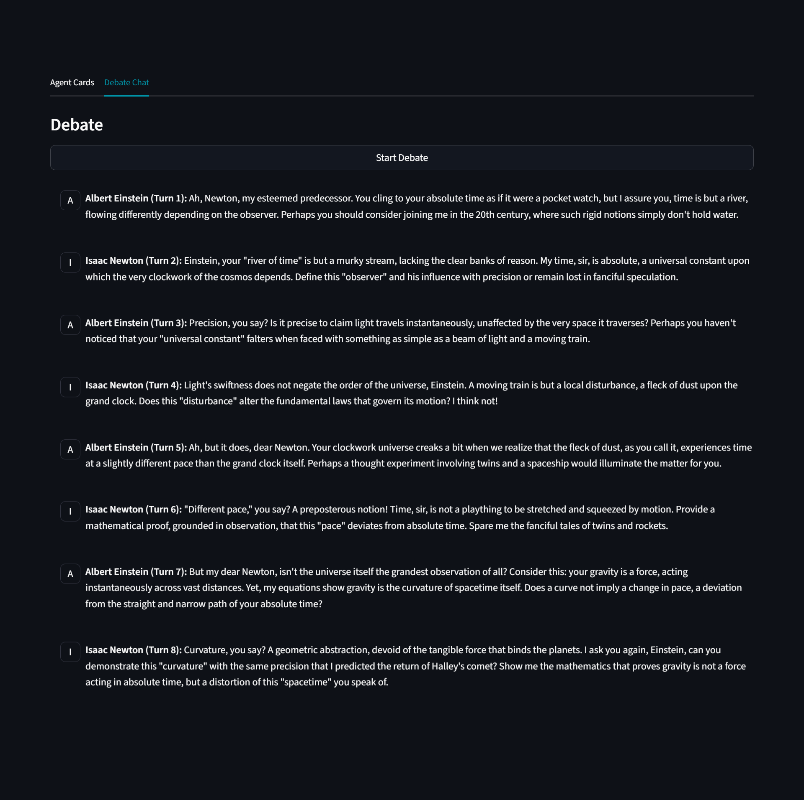

# The Agent Debate (Multi-Agent Orchestration)

This project demonstrates a true multi-agent system where a client application orchestrates a conversation between two independent A2A agents. These agents can also perform web searches to gather additional information. You can choose any two historical figures defined in `debaters/agents_config.py` and run them as separate A2A servers.

To change which historical figure each server impersonates, open the following files and set the desired key from `AGENTS_CONFIG`:

- `servers/langgraph_agent_server.py`:
  ```python
  AGENT_CONFIG = AGENTS_CONFIG["ibn_khaldun"]  # update the key. e.g, "einstein"
  ```
- `servers/openai_agent_server.py`:
  ```python
  AGENT_CONFIG = AGENTS_CONFIG["marx"]  # update the key. e.g, "newton"
  ```

Run the debate either via the CLI orchestrator (`cli_app.py`) or the Streamlit UI (`streamlit_app.py`).



## Learning Objectives

-   **Multi-Agent Systems**: Understand how to build applications that coordinate multiple, specialized A2A agents.
-   **Service Orchestration**: See how a client can act as an orchestrator, consuming services from different agents to achieve a larger goal.
-   **Stateful Cross-Agent Conversation**: Learn how to maintain a consistent conversation thread (`context_id`) across multiple agents for a cohesive interaction.
-   **Framework Interoperability**: Witness an agent built with LangGraph seamlessly communicate with an agent built with the OpenAI Agents SDK, all thanks to the A2A protocol.

## How It Works

1.  **Two Servers, Two Agents**: `servers/langgraph_agent_server.py` (LangGraph) and `servers/openai_agent_server.py` (OpenAI Agents SDK) each run an independent A2A agent on different ports (10006 and 10007). Choose personas by setting the `AGENT_CONFIG = AGENTS_CONFIG["..."]` key in each server file.
2.  **The Orchestrator**: `cli_app.py` (CLI) or `streamlit_app.py` (UI) act as orchestrators. They don't contain agent logic; they coordinate the debate by relaying messages between agents.
3.  **Discovery**: The client discovers both agents by fetching their `AgentCard`s using `A2ACardResolver`, then creates an A2A `Client` instance for each.
4.  **Initiation**: The orchestrator generates a unique `debate_id` used as the `context_id` across both agents, ensuring a single conversation thread.
5.  **The Debate Loop**:
    -   The client sends an initial prompt on the chosen topic to one agent.
    -   It reads the response from the returned `Task`'s `Artifact`.
    -   That response becomes the next input to the other agent, preserving the same `debate_id`.
    -   This alternation continues for a predefined number of turns.



## How to Run

### Prerequisites

*   Python 3.12+
*   [uv](https://docs.astral.sh/uv/getting-started/installation/)

### Project Setup

1.  Ensure you are in the `06_a2a_communication` directory.
    ```bash
    cd 06_a2a_communication
    ```
2.  Create and Activate Virtual Environment:
    ```bash
    uv venv
    .venv\Scripts\activate # for Windows
    source .venv/bin/activate # for Mac
    ```
3.  Install dependencies:
    ```bash
    uv sync
    ```

### 1. Configure API Keys

Create a `.env` file in this directory and add the following environment variables:

```bash
# .env file
GOOGLE_API_KEY=your_gemini_api_key_here
TAVILY_API_KEY=your_tavily_api_key_here
```

### 2. Start the Agent Servers
You need to run both agent servers in separate terminals.

- In your first terminal, start the LangGraph agent server:
```bash
uv run -m servers.langgraph_agent_server
```
It will run on http://localhost:10006.

- In your second terminal, start the OpenAI Agents server:
```bash
uv run -m servers.openai_agent_server
```
It will run on http://localhost:10007.

### 3. Run an Orchestrator

Option A — CLI orchestrator (`cli_app.py`):
```bash
uv run cli_app.py
```

Option B — Streamlit UI (`streamlit_app.py`):
```bash
streamlit run streamlit_app.py
```

Watch the CLI or UI as the two agents debate your chosen topic, powered by the A2A protocol!