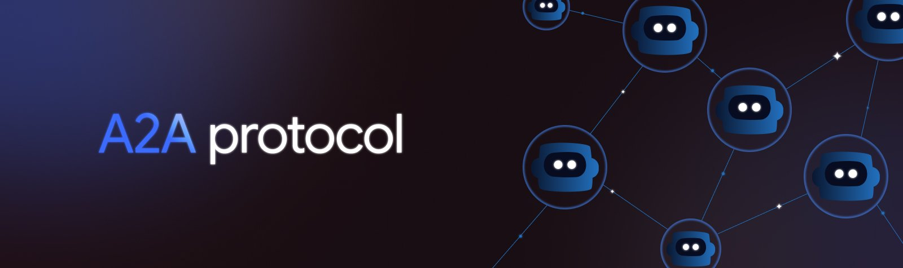

# Learning the Agent2Agent (A2A) Protocol: A Hands-On Guide


Welcome! This repository is a collection of tutorials designed to help you understand and build applications using the Agent2Agent (A2A) protocol. We will start from the absolute basics and build our way up to more complex, multi-agent systems.

### Prerequisites

*   Python 3.12+
*   [uv](https://docs.astral.sh/uv/getting-started/installation/) (a fast Python package manager)

### Project Setup

1. Clone the repository:
```bash
git clone https://github.com/aasherkamal216/A2A_Protocol.git
cd A2A_Protocol
```

2. Create and Activate Virtual Environment:
```bash
uv venv
.venv\Scripts\activate # for Windows
source .venv/bin/activate # for Mac
```

3. Install dependencies:
```bash
uv sync
```

### Core A2A Concepts

Before we begin, here are a few key terms you'll encounter:

*   **Agent**: An autonomous program that can reason, plan, and use tools to accomplish goals.
*   **Agent Card**: A JSON "business card" that an agent publishes. It describes what the agent can do (its skills), where to find it (its URL), and how to communicate with it. Agent discovery is the first step in any A2A interaction.
*   **JSON-RPC 2.0**: The message format used for requests and responses over HTTP. It provides a simple, standardized structure for calling methods on a remote server.
*   **Task**: A stateful unit of work. When a client sends a message, the agent server often creates a `Task` to track the progress of the request, especially for long-running operations.
*   **Message**: A single turn of communication within a task, containing content (like text or files) from either the "user" (the client) or the "agent" (the server).

---

> [!NOTE]
> This repository is structured as a series of tutorials. It is recommended to follow them in order.

For more in-depth information, please refer to the [Official A2A Protocol Documentation](https://a2a-protocol.org/).

### Contributing

Contributions are welcome! This is a learning repository, and any improvements, corrections, or new examples can help others learn too.
